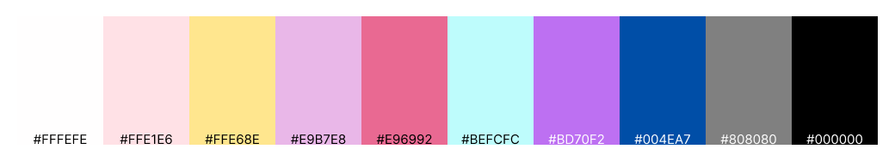
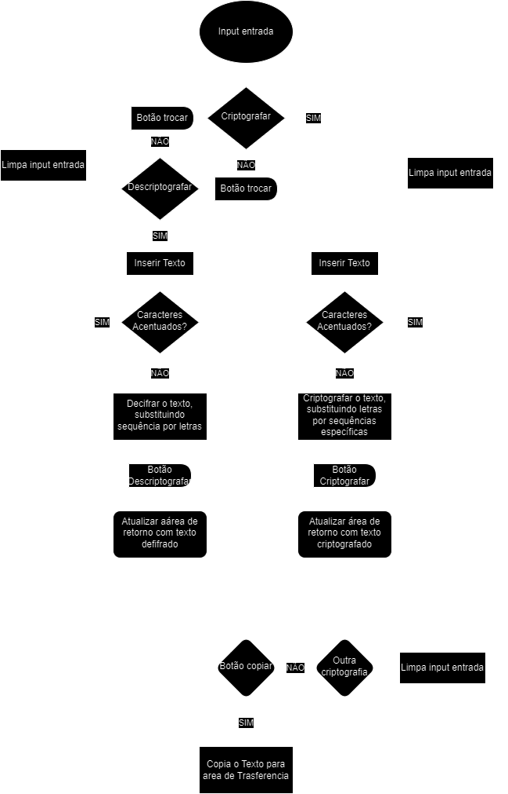
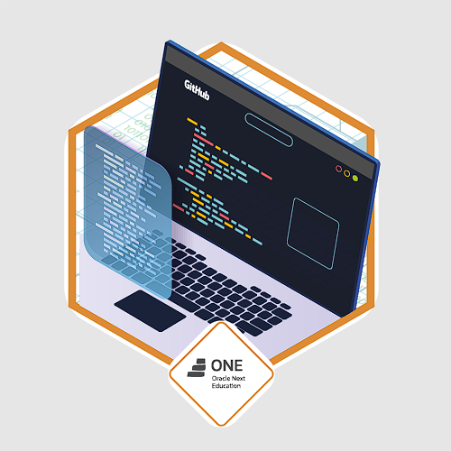

# Criptografador e Descriptografador de Texto

Este é uma simples aplicação web que permite criptografar e descriptografar texto substituindo letras por outras de acordo com um padrão predefinido.

## Funcionalidades

- Criptografar texto substituindo vogais por sequências específicas de letras.
- Descriptografar texto revertendo o processo de criptografia.
- Copiar texto criptografado/descriptografado para a área de transferência.

## Personalização
Este projeto apresenta uma estética única com cores e formas personalizadas.

## Fluxo da Aplicação
## Fluxograma da Aplicação

Aqui está o fluxograma que descreve o funcionamento da aplicação:
Este fluxograma ilustra os diferentes passos e processos envolvidos, desde a entrada de dados até a saída final. Ele foi criado para fornecer uma visão geral clara do fluxo de trabalho da aplicação.

  

***

  <h3>Agradecimento</h3>
  
Este projeto foi desenvolvido como parte do desafio <strong>#challengeonedecodificador6</strong>, realizado através do conteúdo disponibilizado pela Alura.

  
  

